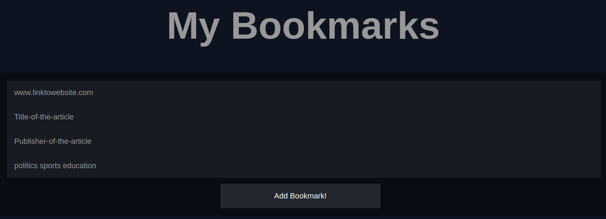

# Bookmarking-API
a book marking API that can be used to add bookmarks along with tags that are associated with them. Built using Node, EJS, MongoDB, Javascript, mongoose, HTML, CSS, jQuery, Ajax.
New tags that are inserted with bookmarks will automatically be added to tags section.
# How to Run
1. `npm install`
2. `npm start`
# Home Page 

# Bookamrks Page 

# Bookmarks Listed - Click to delete 

# Tags - Click to delete 

